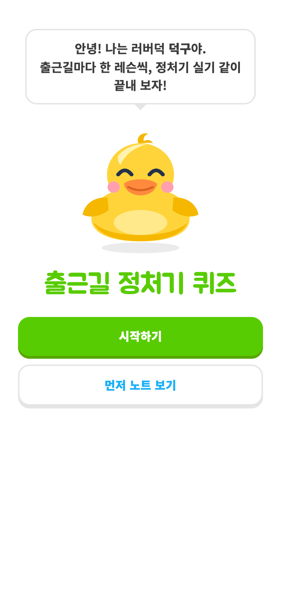
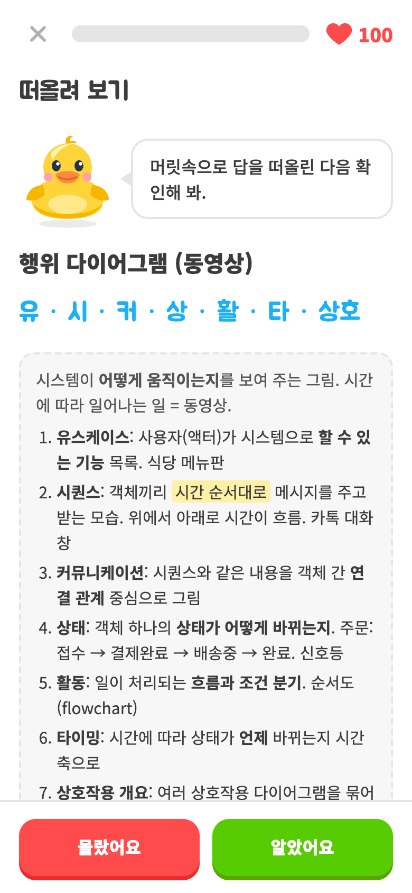

<div align="center">


# 출근길 정처기 퀴즈

**출근길 5분, 정보처리기사 실기를 게임처럼.**

헷갈리는 코드 문제부터 DB, 네트워크, 보안, UML까지<br>
181개의 문제를 듀오링고처럼 짧은 레슨으로 풀어 보세요.

### [👉 지금 풀어 보기](https://ckdwns9121.github.io/jeongcheogi-quiz/)

  

</div>

<br>

## 이런 분께 좋아요

- 실기 시험이 코앞인데 **코드 출력값 문제**에서 자꾸 틀리는 분
- 보안 공격 이름, 네트워크 용어, UML 다이어그램이 **아무리 봐도 안 외워지는** 분
- 두꺼운 책 대신 **출퇴근길에 폰으로 5분씩** 공부하고 싶은 분

<br>

## 무엇을 공부하나요

| 유닛 | 내용 | 카드 |
|---|---|---|
| C 언어 함정 | `a++`와 `++a`, 포인터, 이중 포인터, `static`, `switch` fall-through, 비트 연산 | 10 |
| Java 함정 | 업캐스팅과 오버라이딩, 필드·static은 선언 타입, 생성자 순서, `==`와 `equals` | 10 |
| Python 함정 | 슬라이싱, `//`와 `%`(C와 다름), `append`와 `extend`, `range`, set 연산 | 10 |
| SQL 함정 | `COUNT(*)`와 NULL, `WHERE`와 `HAVING`, `LIKE`, DDL·DML·DCL, 실행 순서, `GRANT`·`REVOKE`·`UPDATE` 문장 만들기 | 13 |
| DB 이론 | 무결성, 키 종류, 정규화, 관계대수, 트랜잭션 ACID, 병행 제어, 회복, 설계 순서 | 56 |
| 네트워크 | OSI 7계층, TCP/IP 4계층, 3-Way Handshake, ARP, DNS, 라우팅, 포트 번호 | 28 |
| 보안 | DoS 계열 공격, XSS·CSRF, 피싱·파밍, 악성코드, 암호, 접근통제, 영문 풀네임 | 37 |
| UML | 구조·행위 다이어그램, 관계 6가지 선 모양, 접근 제어 기호 | 12 |
| 소프트웨어 공학 | 결합도·응집도 순서, 테스트 단계, 폭포수 모델, 통합 테스트 | 5 |

모든 카드에 **한 줄씩 따라가는 풀이**와 **"기억할 것" 한 줄 요약**, 외우는 요령이 들어 있습니다.

<br>

## 이렇게 공부해요

### 1. 레슨 지도에서 하나씩

유닛마다 6문제짜리 레슨이 이어져 있어요. 레슨을 끝내면 다음 레슨이 열리고, 러버덕 캐릭터 **덕구**가 지금 할 레슨 옆에서 기다립니다. 유닛끼리는 순서가 없어서 약한 과목부터 골라 시작해도 돼요.

### 2. 문제는 다섯 가지 방식으로

<table>
<tr>
<td align="center"><br><b>직접 써 보기</b><br>코드 실행 결과를 만들어요. 폰에서는 <b>답 조각</b>을 눌러서,<br>PC에서는 키보드로. 폰에서도 키보드로 바꿀 수 있어요</td>
<td align="center"><br><b>뜻·용어 고르기</b><br>용어를 보고 뜻을, 뜻을 보고<br>용어를 고르는 4지선다</td>
</tr>
<tr>
<td align="center"><br><b>관계 고르기</b><br>UML 선 모양만 보고<br>어떤 관계인지 맞히기</td>
<td align="center"><br><b>떠올려 보기</b><br>답이 한 줄로 안 떨어지는 개념은<br>떠올려 보고 스스로 채점</td>
</tr>
<tr>
<td align="center"><br><b>조각으로 만들기</b><br>순서 맞추기(OSI, 정규화, 결합도…),<br>영문 풀네임(CSRF, ACID…), SQL 문장 만들기</td>
<td></td>
</tr>
</table>

### 3. 막히면 힌트부터


바로 정답을 보기 전에 **힌트 보기**를 눌러 보세요. 누를 때마다 한 단계씩 열려요.

- 코드 문제: 1단계는 풀이 첫 줄, 2단계는 "기억할 것" 요령
- 용어 문제: 예시와 외우는 법
- UML 관계: 선 모양 설명

힌트에는 정답이 그대로 나오지 않게 용어 이름은 ○○로 가리고, 답이 든 줄은 빼 두었어요.

<br clear="right">

### 4. 틀려도 바로 이해하고 넘어가기

<table>
<tr>
<td align="center"><br><b>맞히면</b> 덕구가 날개를 파닥이며 뛰고<br>왜 그 답인지 풀이가 나와요</td>
<td align="center"><br><b>틀리면</b> 정답과 단계별 풀이를 보여 주고,<br>그 문제는 레슨 끝에 다시 나와요</td>
</tr>
</table>

<table>
<tr>
<td align="center"><br><b>연속으로 맞히면</b> 누른 자리에서 폭죽이 터지고<br>"3연속 정답!" 배지가 떠요</td>
<td align="center"><br><b>틀리면</b> 하트가 튀어나와 두 쪽으로 깨지고<br>화면이 살짝 흔들려요</td>
</tr>
</table>

- 레슨마다 **하트 100개**. 틀려도 끝까지 풀면서 해설을 볼 수 있어요.
- 틀린 카드는 **약점 복습**에 자동으로 모여요. 지도 오른쪽 아래 버튼으로 틀린 것만 다시 풀 수 있어요.
- 문제 순서와 보기 순서는 매번 섞여서, 순서를 외워서 풀 수 없어요.

### 5. 매일 이어 가기

레슨을 끝내면 **XP**를 받고(기본 10, 만점 +5, 처음 깬 레슨 +5), 하루에 하나라도 끝내면 **연속 학습일** 불꽃이 켜져요.

### 6. 노트로 다시 보기


유닛 제목 옆 **노트** 버튼을 누르면 카드 전체를 한 페이지로 정리한 노트가 열려요. 퀴즈 모드로 답을 가리고 읽거나, 외운 카드를 체크해서 숨길 수 있어요.

<br clear="right">

<br>

## 폰에 앱처럼 설치하기

설치하면 홈 화면 아이콘으로 바로 열리고, **인터넷이 없어도** 공부할 수 있어요. 레슨 지도 맨 위의 **설치** 버튼을 누르면 됩니다.

<table>
<tr>
<td align="center"><br><b>Android · PC 크롬 · Edge</b><br>설치 버튼 → 브라우저 설치 창에서 <b>설치</b></td>
<td align="center"><br><b>iPhone · iPad</b><br>Apple이 설치 API를 막아 두어서<br>공유 버튼 → <b>홈 화면에 추가</b> 순서를 안내해요</td>
</tr>
</table>

배너가 안 보이면 직접 설치할 수도 있어요.

- **iPhone**: Safari로 열기 → 아래 공유 버튼 → **홈 화면에 추가**
- **Android · PC 크롬**: 주소창의 설치 아이콘 또는 메뉴 → **앱 설치**

푼 기록(XP, 스트릭, 틀린 카드)은 쓰는 기기의 브라우저에 저장돼요. 폰과 PC 기록은 따로 쌓여요.

<br>

---

## 만든 방법

React 없이 **TypeScript로 만든 SPA**입니다. 항해플러스 1주차 과제 [chapter1-2](https://github.com/ckdwns9121/front_6th_chapter1-2)에서 직접 만든 가상 DOM, 스토어, 라우터를 TypeScript로 옮겨 앱의 뼈대로 썼습니다.

| 영역 | 내용 |
|---|---|
| 가상 DOM | `createVNode`(JSX 팩토리) → `normalizeVNode` → `createElement` / `updateElement` 비교 렌더링. SVG 네임스페이스, `innerHTML`, `value` prop을 보강 |
| 이벤트 | WeakMap에 핸들러를 두고 루트에서 한 번에 처리하는 이벤트 위임 |
| 상태 | Redux 방식 `createStore` + `createStorage`(localStorage), `withBatch`로 같은 틱의 렌더를 한 번으로 |
| 라우팅 | History API `Router`. `/lesson/db-1`처럼 레슨마다 주소가 있고, GitHub Pages에서는 `404.html`로 새로고침을 받아요 |
| 퀴즈 로직 | 문제 생성, 답 조각과 가짜 조각 만들기, 채점, 레슨 나누기, 스트릭·XP를 `domain/`의 순수 함수로 분리하고 vitest로 테스트 (코드 문제 전부가 조각만으로 풀리는지도 검사) |
| 캐릭터 | 러버덕 덕구는 **Rive**(`public/rive/duck.riv`)로 움직여요. idle·happy·sad·cheer 네 동작과 상태 머신(happy·sad 트리거, cheer 불)을 [rive-mcp-server](https://github.com/ODU33104/rive-mcp)로 Rive 에디터 없이 만들었어요(`pnpm build:riv`). 런타임은 첫 화면 뒤에 따로 받고, 불러오기 전이나 실패하면 같은 모양의 SVG + CSS 애니메이션이 대신 보여요 |
| 효과 | 폭죽은 캔버스 파티클, 하트·글자는 Web Animations API, 효과음은 음원 파일 없이 Web Audio로 합성. 움직임 줄이기 설정을 켜면 효과를 끕니다 |
| PWA | manifest, service worker(페이지는 네트워크 우선, 나머지는 캐시 우선)로 오프라인 지원. `beforeinstallprompt`를 받아 두었다가 설치 버튼에서 설치 창을 띄우고, 아이폰은 안내 시트로 대신해요 |
| 배포 | `main`에 push하면 GitHub Actions가 테스트 → 빌드 → GitHub Pages 배포 |

### 폴더 구조

```
src/
  lib/          가상 DOM, 이벤트 위임, createStore · createStorage · Router · afterRender · withBatch
  domain/       카드 타입, 레슨 나누기, 문제 만들기·채점, 스트릭·XP (순수 함수)
  stores/       progressStore(XP·스트릭·푼 기록), lessonStore(진행 중인 레슨)
  services/     레슨 시작·채점·완료 흐름, 효과음
  components/   캐릭터(SVG + Rive 연결), 레슨 지도, 문제, 해설 시트, 효과
  pages/        Intro · Home(레슨 지도) · Lesson · Result · NotFound
  data/         cards.json (public/notes.html에서 추출)
public/         notes.html(학습 노트), rive/duck.riv(캐릭터), manifest, service worker, 아이콘
scripts/        카드 추출, 캐릭터 부위 그림(mascot-parts.mjs), Rive 파일 만들기, 아이콘 만들기
```

### 직접 실행하기

```bash
pnpm install
pnpm dev        # 개발 서버
pnpm test       # 단위 테스트
pnpm build      # 타입 체크 + 빌드
pnpm extract    # public/notes.html을 고친 뒤 카드 데이터 다시 뽑기
pnpm build:riv  # 캐릭터 duck.riv 다시 만들기 (공식 런타임으로 상태 머신까지 검증)
```

카드 내용은 `public/notes.html` 한 곳에서 관리해요. 노트를 고치고 `pnpm extract`를 실행하면 퀴즈에도 반영됩니다.
