<div align="center">


# 출근길 IT 퀴즈

**출근길 5분, 개발 공부를 게임처럼.**

정보처리기사 189문제, 프론트엔드 171문제, AWS 79문제를<br>
듀오링고처럼 짧은 레슨으로, 러버덕 **덕구**와 같이 풀어 보세요.

### [👉 지금 풀어 보기](https://ckdwns9121.github.io/duckgu-quiz/)

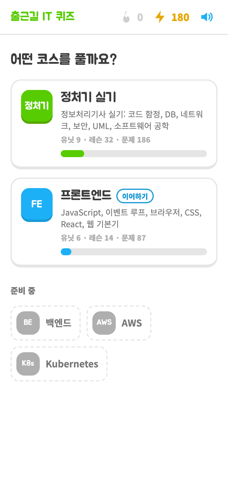 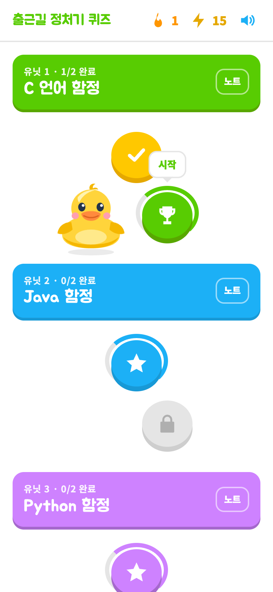 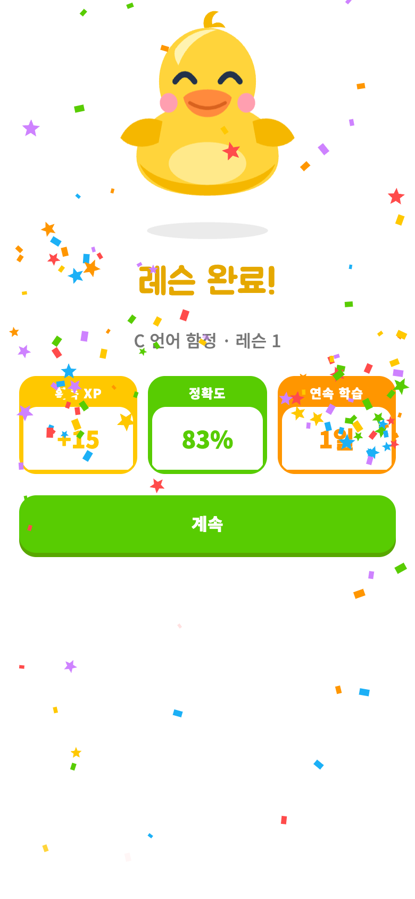

</div>

<br>

## 이런 분께 좋아요

- 정보처리기사 실기가 코앞인데 **코드 출력값 문제**에서 자꾸 틀리는 분
- 보안 공격 이름, 네트워크 용어, UML 다이어그램이 **아무리 봐도 안 외워지는** 분
- 이벤트 루프 출력 순서, 호이스팅, `==`와 `===`처럼 **프론트엔드 기본기를 다시 다지고 싶은** 분
- S3 + CloudFront 배포, IAM 권한, VPC처럼 **AWS에서 막히는 지점**을 미리 알고 싶은 분
- 두꺼운 책 대신 **출퇴근길에 폰으로 5분씩** 공부하고 싶은 분

<br>

## 무엇을 공부하나요

첫 화면에서 코스를 고르면 그 코스의 레슨 지도가 열려요. 코스마다 진행률이 따로 쌓이고, 마지막에 풀던 코스에는 **이어하기** 표시가 붙어요. 백엔드, Kubernetes 코스도 준비하고 있어요.

### 정보처리기사 (189문제)

| 유닛 | 내용 | 카드 |
|---|---|---|
| C 언어 함정 | `a++`와 `++a`, 포인터, 이중 포인터, `static`, `switch` fall-through, 비트 연산 | 10 |
| Java 함정 | 업캐스팅과 오버라이딩, 필드·static은 선언 타입, 생성자 순서, `==`와 `equals`, 오버로딩 | 11 |
| Python 함정 | 슬라이싱, `//`와 `%`(C와 다름), `append`와 `extend`, `range`, set 연산 | 10 |
| SQL 함정 | `COUNT(*)`와 NULL, `WHERE`와 `HAVING`, `LIKE`, DDL·DML·DCL, 실행 순서, `GRANT`·`REVOKE`·`UPDATE` 문장 만들기 | 16 |
| DB 이론 | 무결성, 키 종류, 정규화, 관계대수·관계해석, E-R 다이어그램, 트랜잭션 ACID, 병행 제어, 회복, 설계 순서 | 57 |
| 네트워크 | OSI 7계층, TCP/IP 4계층, 장비별 계층, 3-Way Handshake, ARP, DNS, 라우팅, 포트 번호 | 28 |
| 보안 | DoS 계열 공격, XSS·CSRF, 피싱·파밍, 악성코드, 암호와 키 개수, 접근통제, 인증, 영문 풀네임 | 38 |
| UML | 구조·행위 다이어그램, 관계 6가지 선 모양, 접근 제어 기호, 구성요소 | 14 |
| 소프트웨어 공학 | 결합도·응집도 순서, 테스트 단계, 폭포수 모델, 통합 테스트 | 5 |

### 프론트엔드 (171문제)

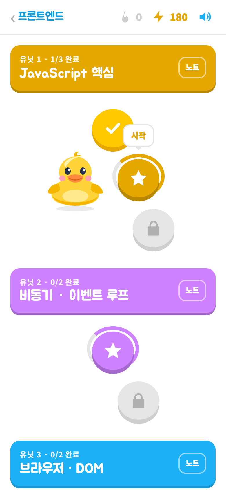

| 유닛 | 내용 | 카드 |
|---|---|---|
| JavaScript 핵심 | 호이스팅, TDZ, 클로저, `var`와 `let` 반복문, 메서드·화살표 함수·콜백의 `this`, `==`와 `===`, `sort()` 함정, 얕은 복사와 `structuredClone`, 디바운스·스로틀 | 20 |
| 비동기 · 이벤트 루프 | 출력 순서(`setTimeout`·`then`·`await` 섞기), `forEach` 안의 `await`, `catch` 뒤의 `then`, try/catch가 못 잡는 에러, 순차 vs 병렬 `await`, `all`·`allSettled`·`any`·`race` 고르기 | 19 |
| 브라우저 · DOM | 렌더링 과정, 리플로우와 layout thrashing, `defer`·`async`·`type="module"`·JS로 넣은 script의 실행 순서, 클릭 한 번의 이벤트 순서, 캡처·버블, `stopImmediatePropagation`, `focus`와 `focusin`, passive 리스너, MutationObserver·rAF 시점, storage 이벤트, 쿠키를 실은 CORS와 preflight, SameSite=Lax, preconnect·preload·prefetch, bfcache, 서비스 워커 업데이트 | 42 |
| CSS | 박스 너비 계산, 마진 상쇄, 명시도와 `!important`, `em`·`rem` 계산, `absolute`의 기준, `sticky`, column일 때 정렬, z-index 9999가 안 먹는 이유 | 13 |
| React | 배치(setTimeout 포함)와 `flushSync`, 부모·자식 effect 순서, `useLayoutEffect`와 cleanup 순서, 같은 자리의 state 보존, 컴포넌트 안의 컴포넌트, `useState` 초기값 계산, children으로 렌더링 줄이기, Context value, 늦게 온 응답(race), 에러 바운더리가 못 잡는 에러, React 19의 ref prop, `useDeferredValue`, 오래된 클로저, `React.memo`와 `useCallback`, StrictMode, 훅 규칙 | 35 |
| Next.js | 서버·클라이언트 컴포넌트 경계(children, import, 함수 props), Next 16의 `await params`, 정적·동적 렌더링(○·●·ƒ), `dynamicParams`, try 안의 `redirect`, `error`·`loading`·`template`, Suspense 스트리밍, Server Action 권한, `NEXT_PUBLIC_` 빌드 인라인, `server-only`, hydration 에러, `useSearchParams`와 Suspense, fetch 캐시와 cacheComponents, `updateTag`, `proxy.ts` | 26 |
| 웹 · 성능 · 보안 | 상황별 상태 코드, 멱등성, `Cache-Control` 고르기, LCP·INP·CLS를 나쁘게 만드는 코드, `innerHTML`과 XSS, 쿠키 속성(HttpOnly·SameSite·Secure) | 16 |

용어 뜻 맞히기 대신 **코드나 상황을 보고 결과·해결책을 고르는 문제**로 만들었고, 오답 보기는 실제로 자주 하는 착각으로 채웠어요. 정답은 손으로 쓰지 않고 실제로 돌려서 확인했어요: JS는 Node, React는 React 19를 jsdom에서, 브라우저 동작은 실제 Chrome에서, Next.js는 Next 16 공식 문서와 실제 빌드로(`tools/frontend/verify/`).

<br clear="right">

모든 카드에 **한 줄씩 따라가는 풀이**와 **"기억할 것" 한 줄 요약**, 외우는 요령이 들어 있습니다.

<br>

### AWS (79문제)

| 유닛 | 내용 | 카드 |
|---|---|---|
| IAM · 보안 | Allow와 Deny가 겹칠 때, 암묵적 거부, EC2 역할, 임시 자격 증명, 팀원 계정 나누기, 유출된 키 대응, 버킷 ARN과 객체 ARN, 다른 계정 역할, IMDSv2 | 10 |
| VPC · 네트워크 | 퍼블릭 서브넷의 조건, NAT 게이트웨이 위치, 예약 IP, 보안 그룹(상태 저장)과 NACL(상태 비저장·번호 순서), 보안 그룹 참조, 피어링 전이 불가, S3 게이트웨이 엔드포인트, 루트 도메인 별칭, ALB와 NLB | 15 |
| EC2 · Lambda · 컨테이너 | 스팟과 2분 알림, 인스턴스 스토어, EBS의 AZ, ELB 상태 검사, Lambda 15분 제한, 실행 환경 재사용, 예약·프로비저닝 동시성, 비동기 재시도, Fargate | 12 |
| S3 | 퍼블릭 액세스 차단, 강한 일관성, 최소 저장 기간, presigned URL과 임시 자격 증명, 브라우저 업로드 CORS, 버전 관리, 멀티파트, 수명 주기 | 11 |
| CloudFront · 배포 | 요청 흐름, OAC, us-east-1 인증서, SPA 새로고침 403, 무효화, TTL, 캐시 키, CloudFront Functions와 Lambda@Edge | 11 |
| DB · 메시징 | RDS Multi-AZ와 읽기 복제본, 장애 조치 엔드포인트, 복제 지연, DynamoDB 일관성·핫 파티션, SQS 가시성 제한·표준과 FIFO·DLQ, SNS 팬아웃 | 12 |
| 운영 · 비용 | 공동 책임 모델, CloudTrail, CloudWatch 경보, Budgets 예측 알림, 요금이 붙는 트래픽, 여러 AZ, RPO와 RTO | 8 |

정답은 AWS 공식 문서로 하나씩 확인했어요. 요금이나 한도처럼 자주 바뀌는 숫자(예: S3 최대 객체 크기가 2025년 12월에 50TB로 늘어남)는 문제로 내지 않았어요.

<br>

## 이렇게 공부해요

### 1. 레슨 지도에서 하나씩

코스 안의 유닛마다 6문제짜리 레슨이 이어져 있어요. 레슨을 끝내면 다음 레슨이 열리고, 러버덕 캐릭터 **덕구**가 지금 할 레슨 옆에서 기다립니다. 유닛끼리는 순서가 없어서 약한 과목부터 골라 시작해도 돼요.

### 2. 문제는 다섯 가지 방식으로

<table>
<tr>
<td align="center">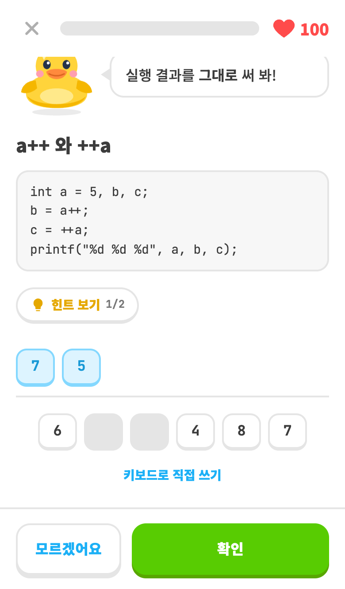<br><b>직접 써 보기</b><br>코드 실행 결과를 만들어요. 폰에서는 <b>답 조각</b>을 눌러서,<br>PC에서는 키보드로. 폰에서도 키보드로 바꿀 수 있어요</td>
<td align="center">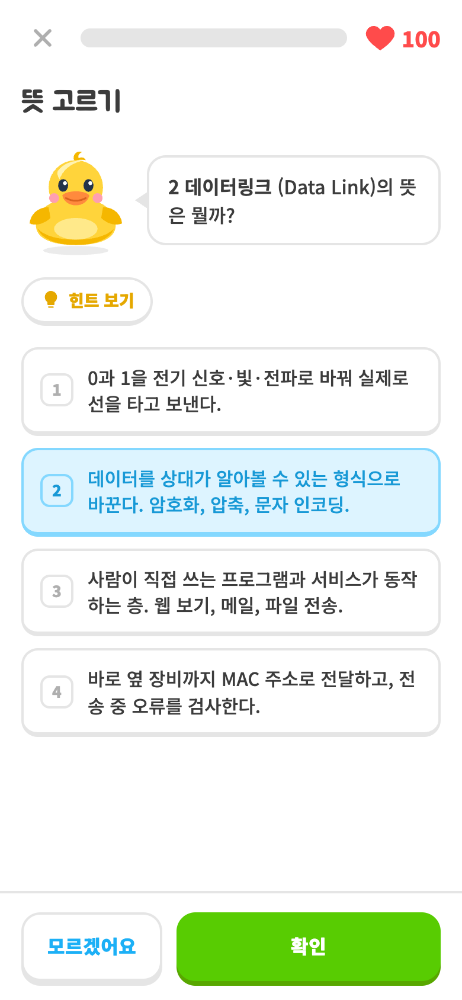<br><b>뜻·용어 고르기</b><br>IDS와 IPS, RIP와 OSPF처럼<br>헷갈리는 것끼리 보기로 나와요</td>
</tr>
<tr>
<td align="center">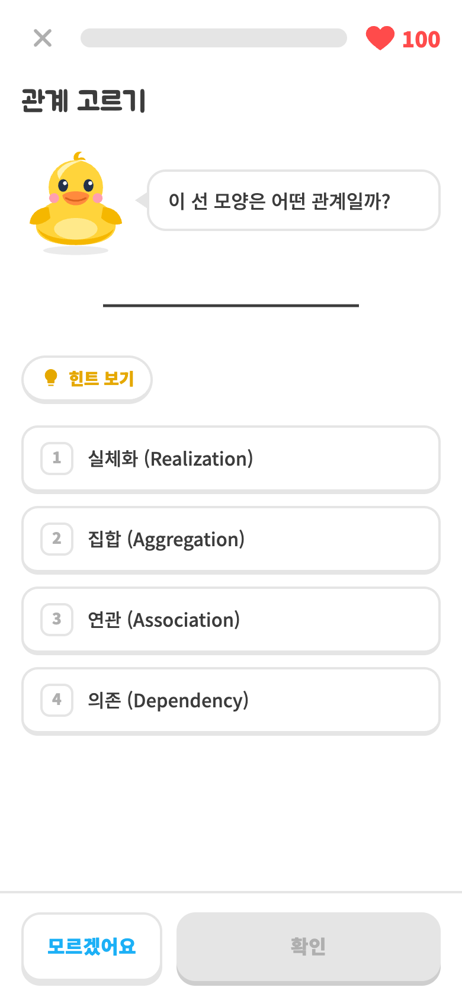<br><b>관계 고르기</b><br>UML 선 모양만 보고<br>어떤 관계인지 맞히기</td>
<td align="center">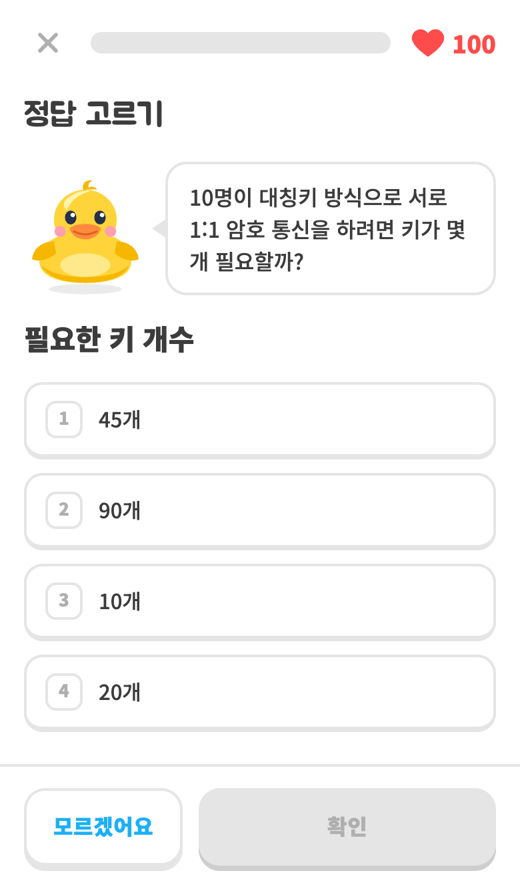<br><b>정답 고르기</b><br>키 개수 계산, LIKE 조건, 회복 기법처럼<br>실기에 나오는 형태로 직접 쓴 문제</td>
</tr>
<tr>
<td align="center">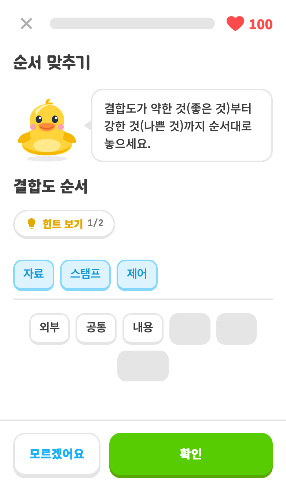<br><b>조각으로 만들기</b><br>순서 맞추기(OSI, 정규화, 이벤트 루프…),<br>영문 풀네임(CSRF, ACID…), SQL 문장 만들기</td>
<td align="center">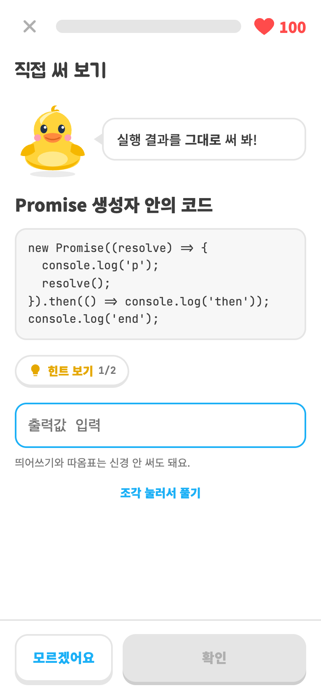<br><b>프론트엔드 출력값</b><br>Promise, setTimeout, 클로저 코드의<br>실행 결과 맞히기</td>
</tr>
</table>

### 3. 막히면 힌트부터

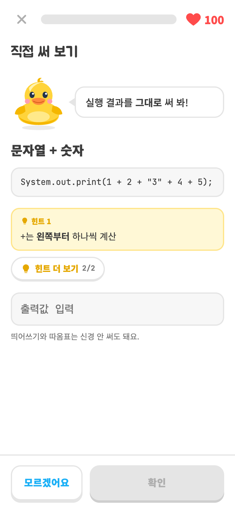

바로 정답을 보기 전에 **힌트 보기**를 눌러 보세요. 누를 때마다 한 단계씩 열려요.

- 코드 문제: 1단계는 풀이 첫 줄, 2단계는 "기억할 것" 요령
- 용어 문제: 예시와 외우는 법
- UML 관계: 선 모양 설명

힌트에는 정답이 그대로 나오지 않게 용어 이름은 ○○로 가리고, 답이 든 줄은 빼 두었어요.

<br clear="right">

### 4. 틀려도 바로 이해하고 넘어가기

<table>
<tr>
<td align="center">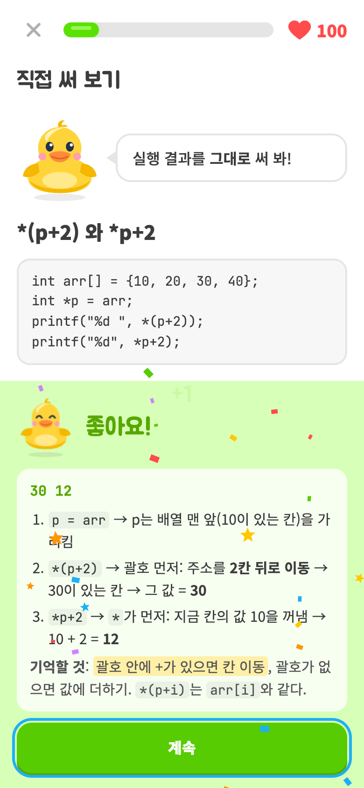<br><b>맞히면</b> 덕구가 날개를 파닥이며 뛰고<br>왜 그 답인지 풀이가 나와요</td>
<td align="center">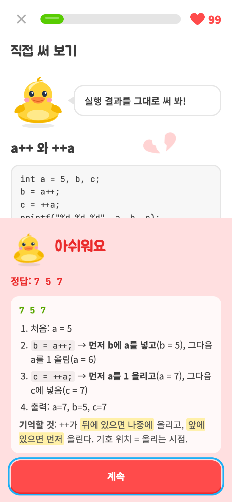<br><b>틀리면</b> 정답과 단계별 풀이를 보여 주고,<br>그 문제는 레슨 끝에 다시 나와요</td>
</tr>
</table>

<table>
<tr>
<td align="center">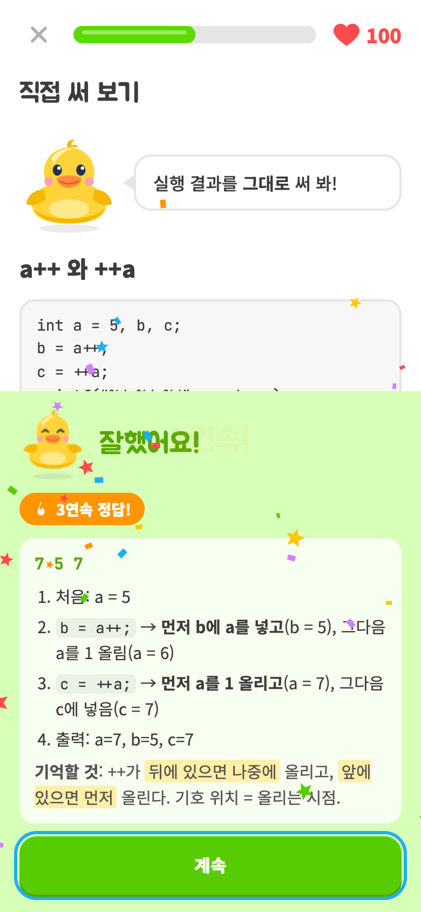<br><b>연속으로 맞히면</b> 누른 자리에서 폭죽이 터지고<br>"3연속 정답!" 배지가 떠요</td>
<td align="center">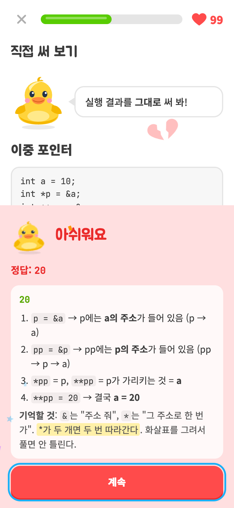<br><b>틀리면</b> 하트가 튀어나와 두 쪽으로 깨지고<br>화면이 살짝 흔들려요</td>
</tr>
</table>

- 레슨마다 **하트 100개**. 틀려도 끝까지 풀면서 해설을 볼 수 있어요.
- 틀린 카드는 **약점 복습**에 자동으로 모여요. 지도 오른쪽 아래 버튼으로 지금 코스에서 틀린 것만 다시 풀 수 있어요.
- 문제 순서와 보기 순서는 매번 섞여서, 순서를 외워서 풀 수 없어요.
- 모든 문제는 앱이 채점해요. 보기는 짧게(첫 문장만) 보여 주고, 전체 설명은 풀고 나서 해설로 봐요.

### 5. 매일 이어 가기

레슨을 끝내면 **XP**를 받고(기본 10, 만점 +5, 처음 깬 레슨 +5), 하루에 하나라도 끝내면 **연속 학습일** 불꽃이 켜져요.

### 6. 노트로 다시 보기

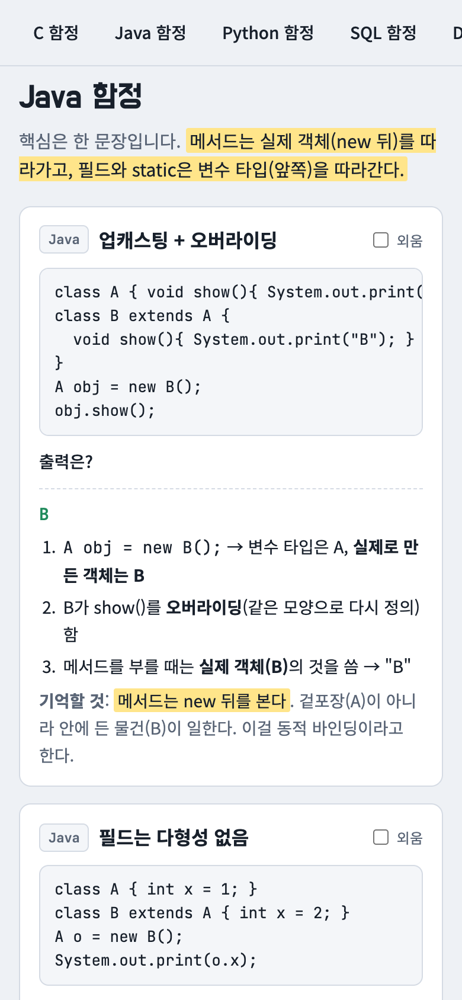

유닛 제목 옆 **노트** 버튼을 누르면 그 코스의 카드 전체를 한 페이지로 정리한 노트가 열려요. 퀴즈 모드로 답을 가리고 읽거나, 외운 카드를 체크해서 숨길 수 있어요.

<br clear="right">

<br>

## 폰에 앱처럼 설치하기

설치하면 홈 화면 아이콘으로 바로 열리고, **인터넷이 없어도** 공부할 수 있어요. 레슨 지도 맨 위의 **설치** 버튼을 누르면 됩니다.

<table>
<tr>
<td align="center">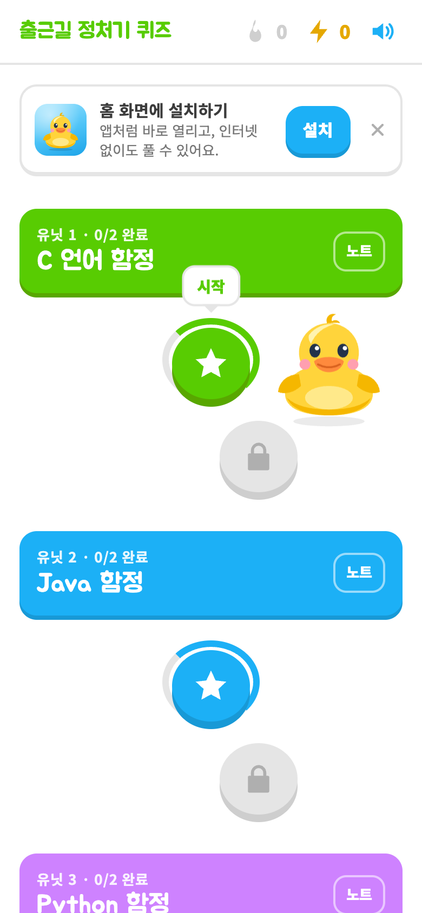<br><b>Android · PC 크롬 · Edge</b><br>설치 버튼 → 브라우저 설치 창에서 <b>설치</b></td>
<td align="center">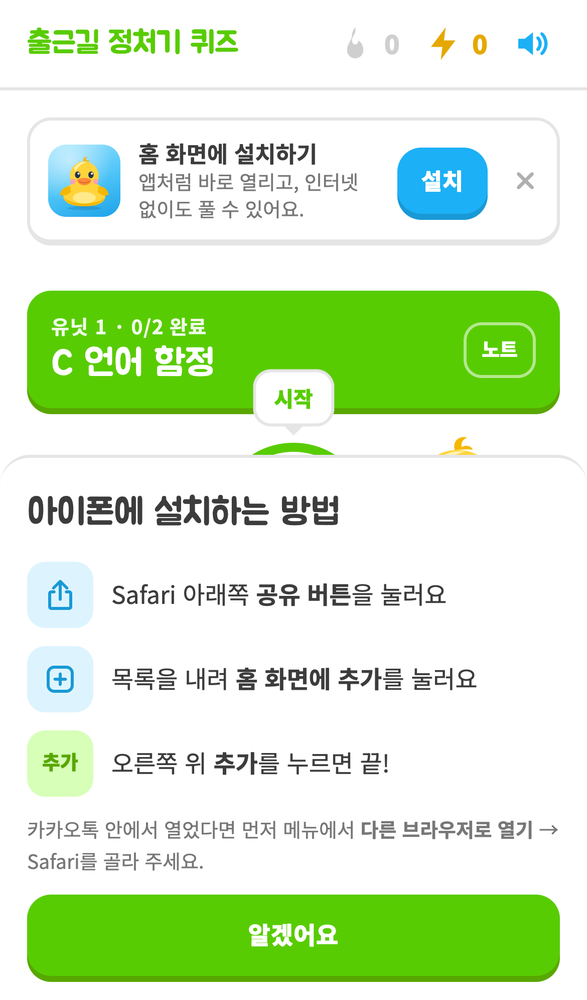<br><b>iPhone · iPad</b><br>Apple이 설치 API를 막아 두어서<br>공유 버튼 → <b>홈 화면에 추가</b> 순서를 안내해요</td>
</tr>
</table>

배너가 안 보이면 직접 설치할 수도 있어요.

- **iPhone**: Safari로 열기 → 아래 공유 버튼 → **홈 화면에 추가**
- **Android · PC 크롬**: 주소창의 설치 아이콘 또는 메뉴 → **앱 설치**

푼 기록(XP, 스트릭, 틀린 카드)은 쓰는 기기의 브라우저에 저장돼요. 폰과 PC 기록은 따로 쌓여요.

방문 수와 레슨 시작·완료, 힌트 사용 같은 이용 통계는 Google Analytics로 모아요. 이름이나 입력한 답처럼 사람을 알아볼 수 있는 정보는 보내지 않아요.

<br>

---

## 만든 방법

React 없이 **TypeScript로 만든 SPA**입니다. 가상 DOM, 스토어, 라우터를 라이브러리 없이 직접 만들어 앱의 뼈대로 썼습니다.

| 영역 | 내용 |
|---|---|
| 가상 DOM | `createVNode`(JSX 팩토리) → `normalizeVNode` → `createElement` / `updateElement` 비교 렌더링. SVG 네임스페이스, `innerHTML`, `value` prop을 보강 |
| 이벤트 | WeakMap에 핸들러를 두고 루트에서 한 번에 처리하는 이벤트 위임 |
| 상태 | Redux 방식 `createStore` + `createStorage`(localStorage), `withBatch`로 같은 틱의 렌더를 한 번으로 |
| 라우팅 | History API `Router`. `/course/frontend`, `/lesson/db-1`처럼 코스와 레슨마다 주소가 있고, GitHub Pages에서는 `404.html`로 새로고침을 받아요 |
| 퀴즈 로직 | 문제 생성, 답 조각과 가짜 조각 만들기, 채점, 레슨 나누기, 스트릭·XP를 `domain/`의 순수 함수로 분리하고 vitest로 테스트 (코드 문제 전부가 조각만으로 풀리는지도 검사). **문제 품질 테스트**: 모든 문제를 여러 번 만들어 보며 답 노출(질문·제목), 보기 길이·중복, 앞 문제에 기대는 질문, 조각 수를 검사 |
| 정답 검증 | 정답을 손으로 쓰지 않아요. JS 출력값은 Node로 실행하고, React 동작은 React 19를 jsdom에서, 브라우저 동작은 Playwright로 실제 Chrome에서, Next.js는 그 버전의 공식 문서와 실제 `next build`로 확인해요 (`tools/frontend/verify/`) |
| 캐릭터 | 러버덕 덕구는 **Rive**(`public/rive/duck.riv`)로 움직여요. idle·happy·sad·cheer 네 동작과 상태 머신(happy·sad 트리거, cheer 불)을 [rive-mcp-server](https://github.com/ODU33104/rive-mcp)로 Rive 에디터 없이 만들었어요(`pnpm build:riv`). 런타임은 첫 화면 뒤에 따로 받고, 불러오기 전이나 실패하면 같은 모양의 SVG + CSS 애니메이션이 대신 보여요 |
| 효과 | 폭죽은 캔버스 파티클, 하트·글자는 Web Animations API, 효과음은 음원 파일 없이 Web Audio로 합성. 움직임 줄이기 설정을 켜면 효과를 끕니다 |
| PWA | manifest, service worker(페이지는 네트워크 우선, 나머지는 캐시 우선)로 오프라인 지원. `beforeinstallprompt`를 받아 두었다가 설치 버튼에서 설치 창을 띄우고, 아이폰은 안내 시트로 대신해요 |
| 통계 | Google Analytics 4. 화면 이동은 향상된 측정이 잡고, 앱은 레슨 시작·완료(정확도), 힌트, 설치 같은 학습 이벤트만 보내요. 배포된 사이트에서만 켜져요 |
| 배포 | `main`에 push하면 GitHub Actions가 테스트 → 빌드 → GitHub Pages 배포 |

### 폴더 구조

```
src/
  lib/          가상 DOM, 이벤트 위임, createStore · createStorage · Router · afterRender · withBatch
  domain/       카드 타입, 레슨 나누기, 문제 만들기·채점, 스트릭·XP (순수 함수)
  stores/       progressStore(XP·스트릭·푼 기록), lessonStore(진행 중인 레슨)
  services/     레슨 시작·채점·완료 흐름, 효과음
  components/   캐릭터(SVG + Rive 연결), 레슨 지도, 문제, 해설 시트, 효과
  pages/        Intro · Courses(코스 고르기) · Course(레슨 지도) · Lesson · Result · NotFound
  data/         courses.json(코스·유닛 목록), cards/<코스>.json (학습 노트에서 추출)
public/         notes.html · notes-frontend.html · notes-aws.html(코스별 학습 노트), rive/duck.riv(캐릭터), manifest, service worker, 아이콘
scripts/        카드 추출, 캐릭터 부위 그림(mascot-parts.mjs), Rive 파일 만들기, 아이콘 만들기
tools/
  notes_gen.py  코스 노트 HTML 생성기 (공통)
  frontend/     프론트엔드 문제·출력값 코드, verify/(정답 검증 실험)
  aws/          AWS 문제
docs/
  backlog/      코스별 보강할 것
  screenshots/  README 스크린샷
.claude/skills/quiz-quality/   문제 품질 원칙과 검토 순서 (Claude Code 스킬)
```

### 직접 실행하기

```bash
pnpm install
pnpm dev        # 개발 서버
pnpm test       # 단위 테스트
pnpm build      # 타입 체크 + 빌드
pnpm extract    # 학습 노트를 고친 뒤 코스별 카드 데이터 다시 뽑기
pnpm build:riv  # 캐릭터 duck.riv 다시 만들기 (공식 런타임으로 상태 머신까지 검증)
```

문제를 만들거나 고칠 때의 원칙과 검토 순서는 `.claude/skills/quiz-quality/SKILL.md`에 있어요. `DUMP=frontend pnpm test dump`로 모든 문제를 텍스트로 뽑아 읽어 볼 수 있어요.

카드 내용은 코스마다 학습 노트 한 곳(`public/notes.html`, `public/notes-frontend.html`, `public/notes-aws.html`)에서 관리해요. 프론트엔드·AWS 노트는 `tools/`의 파이썬 파일로 만들어요(`python3 tools/frontend/gen_fe.py`, `python3 tools/aws/gen_aws.py`). 노트를 고치고 `pnpm extract`를 실행하면 퀴즈에도 반영됩니다.

새 코스는 `src/data/courses.json`에 코스와 유닛을 적고, 같은 형식의 노트를 만든 뒤 `pnpm extract`로 뽑은 카드를 `src/domain/content.ts`에 이어 주면 돼요.
